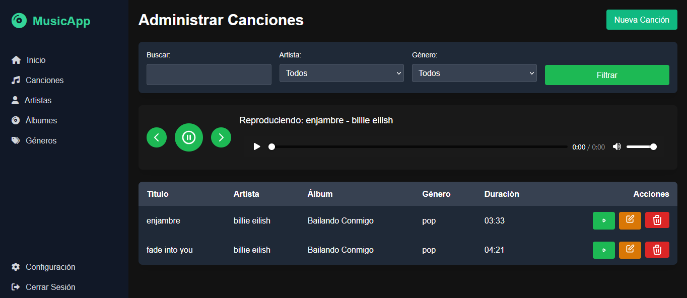

# Pmusic
Pmusic es una aplicación web para escuchar música en línea, desarrollada con Laravel (PHP) y diseñada en Visual Studio Code. Utiliza Heydi como sistema de gestión de base de datos, lo que garantiza un almacenamiento eficiente y seguro de la información musical y de usuario. Inspirada en plataformas como Spotify, Pmusic ofrece una experiencia intuitiva y moderna para explorar, reproducir y organizar canciones desde cualquier dispositivo.

## 📸 Capturas de Pantalla

### Inicio

### Módulo de productos

> 📂 Guarda las imágenes en una carpeta llamada img dentro del proyecto.

---

## ⚙️ Requisitos

Backend: Laravel (PHP)

Base de datos: Heydi

Entorno de desarrollo: Visual Studio Code

---

## 🛠️ Instalación paso a paso

PASO 1: Preparar el entorno
1. Instalar Visual Studio Code
Descárgalo desde: https://code.visualstudio.com/

Instálalo y abre el programa.

2. Instalar XAMPP o Laragon (opcional pero recomendado para Apache y PHP)
Descarga desde:

XAMPP: https://www.apachefriends.org/es/index.html

Laragon: https://laragon.org/

Esto incluye Apache, PHP y MySQL, necesarios para desarrollo local.

PASO 2: Instalar PHP, Composer y Laravel
1. Verifica si ya tienes PHP

php -v

Si no lo tienes, instálalo o usa XAMPP/Laragon.

2. Instalar Composer (gestor de dependencias de PHP)
Descargar desde: https://getcomposer.org/

Verifica la instalación:

composer -V

Instalar Laravel

composer global require laravel/installer

Agrega Laravel al PATH si es necesario y verifica:

laravel --version

PASO 3: Crear el proyecto Laravel
En tu terminal, ve a la carpeta donde quieras crear tu app:

cd C:\ruta\de\tu\carpeta
laravel new pmusic

Esto creará la carpeta pmusic con toda la estructura del proyecto.

PASO 4: Configurar Heydi (Base de datos)
Asumiendo que Heydi es HeidiSQL, un cliente gráfico para administrar bases de datos MySQL o MariaDB:

1. Instalar HeidiSQL
Descargar desde: https://www.heidisql.com/download.php

2. Crear la base de datos
Abre HeidiSQL.

Conéctate al servidor local (localhost).

Crea una nueva base de datos, por ejemplo: pmusic_db.

PASO 5: Conectar Laravel con Heydi
En el archivo .env del proyecto Laravel:

DB_CONNECTION=mysql
DB_HOST=127.0.0.1
DB_PORT=3306
DB_DATABASE=pmusic_db
DB_USERNAME=root
DB_PASSWORD=

Ajusta DB_USERNAME y DB_PASSWORD según tu configuración de MySQL.

Guarda el archivo y luego corre:

php artisan migrate

Esto creará las tablas básicas de Laravel (usuarios, contraseñas, etc.).

PASO 6: Iniciar el servidor de desarrollo
Desde la terminal, dentro del proyecto:

php artisan serve
Verás algo como:

Starting Laravel development server: http://127.0.0.1:8000

Abre ese enlace en tu navegador y ya estará funcionando Pmusic.

PASO 7: Abrir y editar el proyecto en Visual Studio Code

code .

Desde ahí puedes editar vistas, rutas, controladores, modelos, etc.

PASO 8: Crear tus propias rutas y funcionalidades (por ejemplo, música)
Comienza a trabajar con:

Modelos: php artisan make:model Cancion -m

Controladores: php artisan make:controller CancionController

Vistas: en la carpeta resources/views

Rutas: en routes/web.php